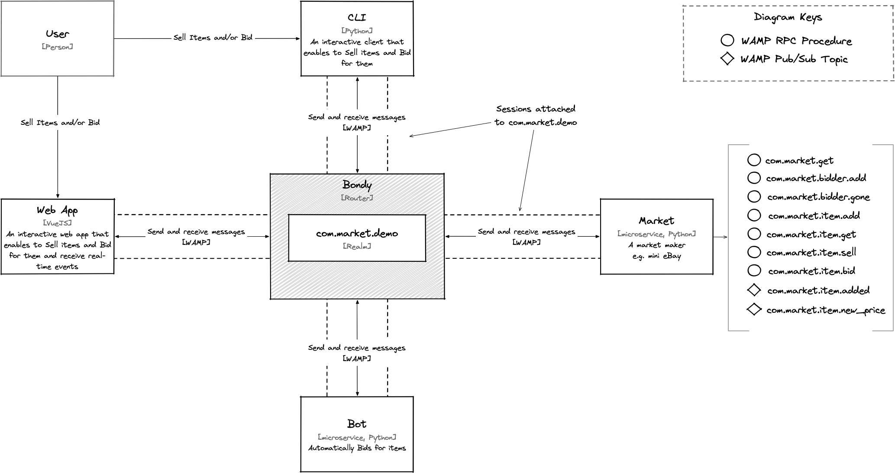

# Bondy Demo

Simple example demonstrating the use of routed Remote Procedure Calls (RPC) and Publish/Subscribe using [Bondy](http://www.bondy.io).

## Architecture
The demo implements a simple market maker as depicted in the following diagram.



### Actors

* User: A human using either the CLI or the Web App.
* Web App: A single page application written written in Typescript using VueJS and Autobahn JS (Browser).
* CLI: A command line interface written in Python and using Autobahn Python WAMP client.
* Bot: A microservice that allow the creation of named bots (via its CLI). Bots will automatically bid for items.
* Market: A microservice implementing a simple market maker.
    * The market registers the following RPC Procedures:
        * `com.market.get`
        * `com.market.bidder.add`
        * `com.market.bidder.gone`
        * `com.market.bidder.item.add`
        * `com.market.bidder.item.get`
        * `com.market.bidder.item.sell`
        * `com.market.bidder.item.bid`
    * The market published events under the following topics:
        * `com.market.item.added`
        * `com.market.item.new_price`

See further descriptions of each actor in the sections below.


## Running the Demo

### Prerequisites

* `make` (normally present in macOS, Linux and Windows)
* Python 3.7+
* [Docker](https://www.docker.com) (Docker Desktop in case you use macOS or Windows)

### Setup

The demo environment is started by the default make target.
``` bash
% make
```

This will run Bondy on docker (if necessary) then start the marketplace.

**Note:** Bondy takes a few seconds to start, initialize and be ready to accept connections. You should see the market script trying to reconnect until Bondy is ready. Typically, a series of logs similar to:
```
2022-10-24T12:33:12 trying transport 0 ("ws://localhost:18080/ws") using connect delay 0
2022-10-24T12:33:12 connecting once using transport type "websocket" over endpoint "tcp"
2022-10-24T12:33:12 Connection failed: TransportLost: failed to complete connection
2022-10-24T12:33:12 trying transport 0 ("ws://localhost:18080/ws") using connect delay 2.198465193966359
2022-10-24T12:33:14 connecting once using transport type "websocket" over endpoint "tcp"
```

### Interactive client

A client is available to interact with the market.
``` bash
% make client
```

It will first print the help and prompt you to enter a command.

A client can only call RPCs on the market:
* `com.market.get`: To get all the listed items.
* `com.market.item.bid`: To bid on a listed item.
* `com.market.item.sell` To put a new item on the market place.

Under the hood it will call `com.market.bidder.add` to identify itself as a bidder.
On exit it calls `com.market.bidder.gone` to dereference itself as a bidder.

Once you are familiar with the marketplace, listing, selling and bidding on items, you can try and compete against a bot.

### Bot

A bot has a name (`BOT_NAME` variable, default: _Bob_) and is configured to:
* buy any item cheaper than a given price (`BOT_LIMIT` variable, default: $10).
* bid adding a given amount to the highest bid (`BOT_INCR` variable, default $1).
* take some time (`BOT_LAG` variable, default: 5s) to perform the bid, i.e. a lag between computing the bid price and actually bidding.
``` bash
% make bot

% make bot BOT_NAME=Alice BOT_LIMIT=12 BOT_INCR=2
```

**Note:** A bot gives up on an item after 3 consecutive bidding failures.

A bot subscribes to 2 topics:
* `com.market.item.added`: To know when a new item is on offer.
* `com.market.item.new_price`: To know when there is a new accepted bid.

Similarly to the client, it calls some RPCs to try and win some items:
* `com.market.bidder.add` to identify itself as a bidder.
* `com.market.get`: To get all the listed items when it joins the marketplace.
* `com.market.item.bid`: To bid on a listed item.
* `com.market.item.get`: To get the details of a specific item for optimum bid.

Once you are familiar with the log printed by the bot, you can try and have several of them competing against each other.

## Bondy

You run the Bondy router from the `make` target: `bondy_docker`.
``` bash
% make bondy_docker
```

## Market

Run the marketplace from the `make` target: `market`
``` bash
% make market
```

This will create the python virtual environment with all the dependencies required to run the script.
The script then connects to Bondy and register the following URIs:
* `com.market.bidder.add`: When a new bigger joins, it has to give a name to be able to bid.
* `com.market.bidder.gone`: When a client gently leave the market, i.e. no errors or interuptions.
* `com.market.get`: To get all the listed items.
* `com.market.item.bid`: To bid on a listed item.
* `com.market.item.get`: To get the details of a specific item.
* `com.market.item.sell` To put a new item on the market place.

The market publishes the following topics:
* `com.market.item.added`: When a new item is on offer.
* `com.market.item.new_price`: When a bid was accepted.

## Troubleshooting

### Can't set long node name!
`make bondy_docker` exits immediately.
The Docker container `bondy-demo` exits with error 1 and the logs are:
```
=INFO REPORT==== 30-Sep-2022::16:17:19.233492 ===
Can't set long node name!
Please check your configuration

=SUPERVISOR REPORT==== 30-Sep-2022::16:17:19.233533 ===
    supervisor: {local,net_sup}
    errorContext: start_error
    reason: {'EXIT',nodistribution}
    offender: [{pid,undefined},
               {id,net_kernel},
               {mfargs,{net_kernel,start_link,
                                   [#{clean_halt => true,
                                      name => 'longnameacec5441-bondy',
                                      name_domain => longnames,
                                      supervisor => net_sup}]}},
               {restart_type,permanent},
               {significant,false},
               {shutdown,2000},
               {child_type,worker}]

Kernel pid terminated (application_controller) ({application_start_failure,kernel,{{shutdown,{failed_to_start_child,net_sup,{shutdown,{failed_to_start_child,net_kernel,{'EXIT',nodistribution}}}}},{kernel,start,[normal,[]]}}})

Crash dump is being written to: /dev/null...done
```

FIX ME!
Make sure `epmd` is running:
`epmd -daemon` does not work

### docker: Error response from daemon: Conflict.
There is already a container with this name running in Docker.
As the message says, remove the duplicate and start over.
